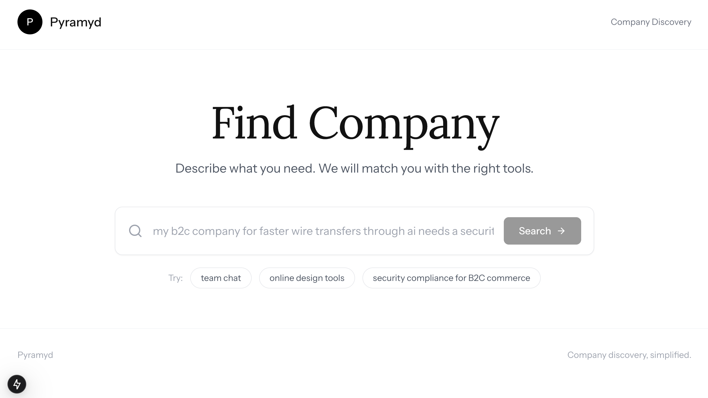
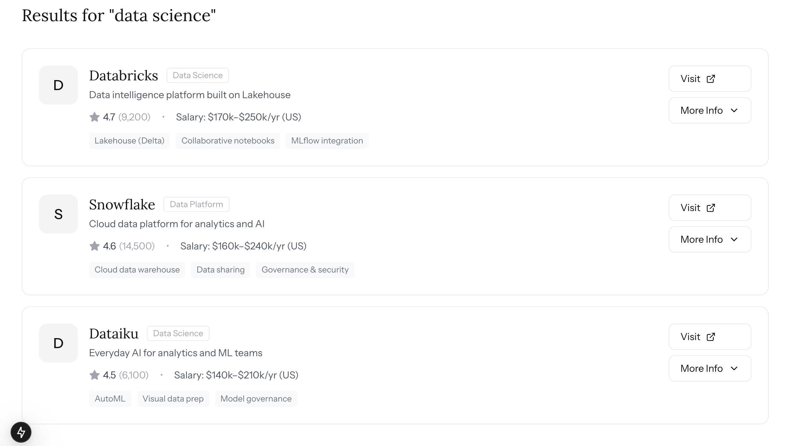
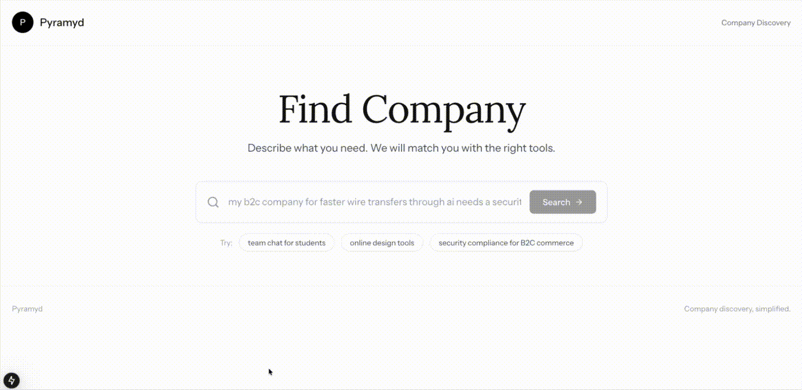

# AI Product Discovery with RAG

**Semantic Retrieval · Hybrid Ranking · Preference-Aware Explanations**

## 🔗 **Disclaimer**: See [DISCLAIMER.md](DISCLAIMER.md)

## Overview

This project implements a **decision-focused Retrieval-Augmented Generation (RAG) system** for company discovery and comparison.\
Unlike generic “chat over a CSV” demos, the system treats discovery as a **retrieval + ranking + explanation** problem under **user constraints and preferences**, and uses an LLM **only to explain and justify results**, not to rank them.

The system produces: - **Top-K ranked results (e.g., Top 5)** using deterministic scoring - **LLM-generated explanations** for *why each result matches* and *why the ordering makes sense* - **Grounded comparisons** with citations to retrieved evidence

This design emphasizes **stability, interpretability, and evaluability**.

------------------------------------------------------------------------

## Demo

### Search Interface



### Example Result: “data science” query



### Full Interaction (GIF)



------------------------------------------------------------------------

## Key Design Principle

> **The LLM explains the ranking — it does not decide it.**

Ranking is performed by a hybrid scoring function.\
The LLM is used *afterward* to generate transparent, evidence-backed reasoning.

------------------------------------------------------------------------

## What the System Does

### Input

-   Natural-language query\
    *e.g., “High-paying entry-level roles with strong work-life balance”*
-   Optional hard constraints\
    *(location, salary bounds, remote eligibility)*
-   Optional preference weights\
    *(salary vs culture vs growth)*

### Output

-   **Top 3 ranked companies/roles**
-   **Per-item justification** (“why this matches”)
-   **Global ranking explanation** (“why #1 beats #2”)
-   **Evidence citations** to reviews / structured fields

------------------------------------------------------------------------

## Architecture Overview

User Query ↓ Dense Retrieval (Embeddings) ↓ Candidate Pool (Top N) ↓ Constraint Filtering ↓ Hybrid Ranking (Semantic + Utility) ↓ Top 3 Results (Deterministic) ↓ LLM Explanation (Grounded, Non-Reordering) ↓ User-Facing Output

------------------------------------------------------------------------

## Core Components

### 1. Semantic Retrieval

-   Embeddings: `BAAI/bge-large-en-v1.5`
-   LLM_MODEL: `Qwen/Qwen2.5-7B-Instruct`
-   Chunked review text and descriptions
-   FAISS vector index
-   Query → top-N semantic candidates

### 2. Hybrid Ranking (Deterministic)

Each candidate receives:

final_score = alpha · semantic_similarity + (1 − alpha) · utility(structured_features, user_weights)

Where: - `semantic_similarity` = embedding similarity - `utility` = normalized structured features (salary, rating, interview difficulty, etc.) - `alpha` controls semantic vs structured importance

The **Top 3** are selected *before* invoking the LLM.

------------------------------------------------------------------------

### 3. Preference-Aware Utility Modeling

Structured attributes are normalized and combined using user-defined weights:

utility(i) = sum_k w_k · f_k(i)

This reframes discovery as a **multi-criteria decision problem**, not just NLP.

------------------------------------------------------------------------

### 4. Grounded LLM Explanations (Post-Ranking)

For the Top 3 results, the LLM: - **Explains why each result matches the query** - **Explains why the ordering makes sense** - Uses: - score breakdowns - structured fields - retrieved evidence snippets - Is explicitly instructed **not to reorder or invent facts**

#### Example Output

1.  **Company A** (Score 0.82)
    -   Why: Strong semantic match to “growth + work-life balance,” competitive salary, and multiple reviews citing flexible schedules \[A1\]\[A3\].
2.  **Company B** (Score 0.79)
    -   Why: Similar role alignment, but lower salary and mixed WLB evidence \[B2\].

**Why this ordering:**\
Company A outranks Company B due to stronger structured alignment (salary + rating), despite similar semantic relevance.

------------------------------------------------------------------------

### 5. Evaluation

-   Retrieval: Recall\@K, MRR, nDCG\@K
-   Ranking quality under constraints
-   Optional grounding checks:
    -   citation coverage
    -   claim–evidence overlap

------------------------------------------------------------------------

## Repository Structure

``` text
.
├── artifacts/        # FAISS index, embeddings, experiment outputs (gitignored)
├── data/             # Raw CSV data (gitignored)
├── notebooks/        # EDA, indexing, experiments
├── scripts/          # Entry points (UI, evaluation)
├── src/
│   ├── data.py       # Data loading / cleaning
│   ├── embeddings.py # Embedding generation
│   ├── index.py      # FAISS index
│   ├── retrieval.py  # Candidate retrieval
│   ├── ranker.py     # Hybrid + preference-aware ranking
│   ├── rag.py        # Evidence assembly
│   ├── llm.py        # Explanation generation
│   ├── eval.py       # Metrics and reporting
│   └── ui.py         # User interface
├── scripts/run_ui.py
├── environment.yml
└── requirements.txt
```

**LLM Explanation Prompt (Conceptual)**

The LLM receives: Query, constraints, preference weights (optional and can be natural language)

**Return:** Top 3 results (already ranked) Score breakdowns Evidence snippets with IDs

Instructions: Do not change the ranking Cite evidence for each claim Explain both per-item relevance and global ordering

**TODO: Roadmap (Making It Outstanding)** Tier 2 — Research-Oriented Extensions Preference-conditioned embeddings

Counterfactual preference stability analysis

Sensitivity analysis over alpha and weights

Tier 3 — Engineering & Polish Config-driven experiments (YAML)

Automated experiment logging

Unit tests + CI

UI score breakdowns (“Why this result?”)

Side-by-side comparison view

Resume Positioning (Example) Designed a preference-aware retrieval and ranking system for company discovery using dense embeddings and structured signals.

Implemented deterministic hybrid ranking with LLM-generated, evidence-backed explanations for top-K results.

Built an evaluation suite (Recall\@K, nDCG\@K) demonstrating improvements over embedding-only baselines.

------------------------------------------------------------------------

## Quickstart (Local)

Install deps:

``` bash
pip install -r requirements.txt
```

Run the Gradio UI:

``` bash
python scripts/run_ui.py
```

Artifacts are created under `artifacts/` on first run: - `docs.json` - `embeddings.npy` - `faiss.index`

## Quickstart (Notebook)

Run the notebook end-to-end in order: - Build docs - Generate embeddings - Build FAISS index - Retrieve + (optional) deterministic re-ranking - (optional) grounded RAG answer generation